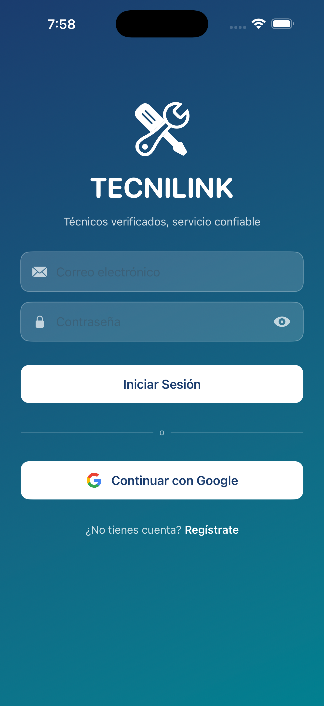
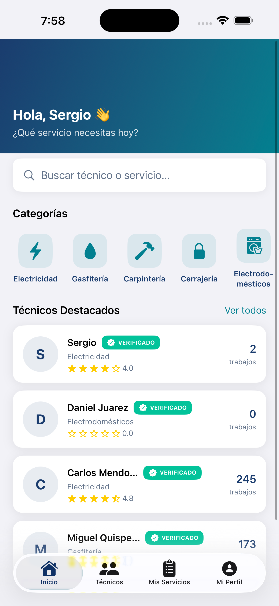
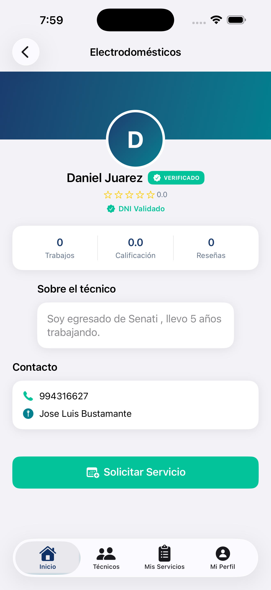
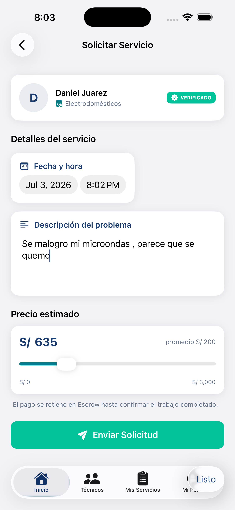
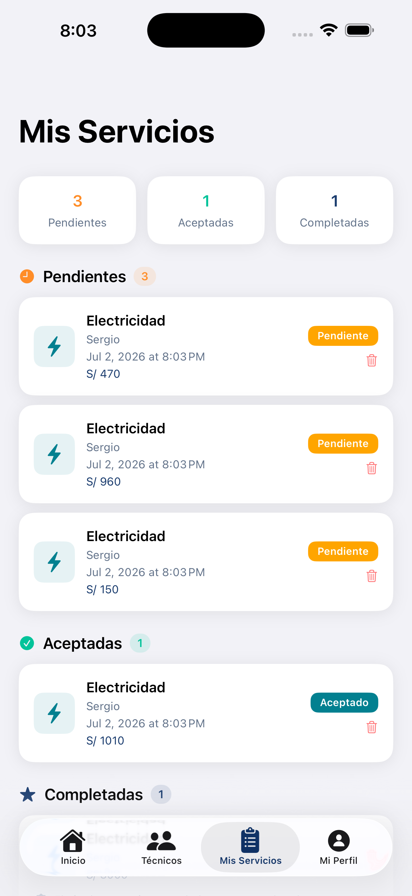
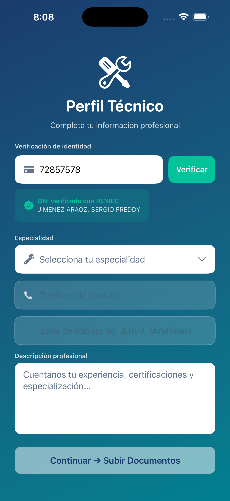

# TECNILINK 🔧

> Plataforma digital que conecta usuarios con técnicos verificados en servicios del hogar en Arequipa, Perú.


---

## 📱 Capturas de pantalla

<p align="center">
  
  
  
  
  
</p>

<p align="center">
  
</p>

---

## 🎬 Video Demo

> 📺 **[Ver demo en YouTube](https://youtube.com/LINK_AQUI)**

---

## 📖 Descripción

TECNILINK es una app iOS nativa que conecta usuarios con técnicos verificados en servicios del hogar. El diferencial principal es el **sistema de verificación de identidad en tiempo real con RENIEC**, que garantiza que cada técnico es quien dice ser antes de aparecer en la plataforma.

## 🔄 Flujos principales

### Flujo del Cliente
Registro → Buscar técnico verificado → Ver perfil + DNI Validado →
Solicitar servicio (precio + descripción + fecha) →
Esperar respuesta del técnico → Ver aceptación en Mis Servicios →
Confirmar trabajo completado → Calificar técnico (⭐⭐⭐⭐⭐)

### Flujo del Técnico
Registro → Verificación DNI con RENIEC →
Completar perfil (especialidad, zona, descripción) →
Subir documentos (DNI, certificado, selfie, fotos de trabajo) →
Esperar aprobación del admin →
Dashboard activo → Ver solicitud en detalle →
Aceptar o Rechazar → Realizar trabajo → Marcar como completado

### Flujo del Administrador
Login como admin → Panel de verificación →
Ver técnicos pendientes → Revisar DNI verificado con RENIEC →
Ver documentos físicos subidos → Aprobar o rechazar con motivo

**Especialidades disponibles:**
- ⚡ Electricidad
- 💧 Gasfitería
- 🪚 Carpintería
- 🔐 Cerrajería
- 🧺 Electrodomésticos
- 🖌️ Pintura / Albañilería

**Zona de cobertura:** Distrito José Luis Bustamante y Rivero, Arequipa, Perú

---

## 🏗️ Stack Tecnológico

| Capa | Tecnología |
|------|-----------|
| Lenguaje | Swift 5.9 |
| UI Framework | SwiftUI |
| Arquitectura | MVVM (ObservableObject / StateObject) |
| Autenticación | Firebase Auth (Email + Google Sign-In) |
| Base de datos | Firebase Firestore |
| Almacenamiento | Cloudinary |
| Verificación DNI | API Factiliza (RENIEC) |
| Persistencia local | Core Data |
| Networking | URLSession + async/await |

---

## 👥 Roles de usuario

### 👤 Cliente
- Registro con email/contraseña o Google Sign-In
- Búsqueda y filtrado de técnicos verificados por especialidad
- Solicitud de servicio con precio estimado (slider + campo de texto)
- Historial con estados: Pendiente / Aceptado / Completado / Rechazado
- Confirmación de trabajo completado
- Calificación del técnico (1-5 estrellas + comentario)

### 🔧 Técnico
- Registro con verificación de DNI en tiempo real (RENIEC)
- Subida de documentos: DNI, certificado técnico, selfie, fotos de trabajos
- Dashboard con filtros: Nuevas / En curso / Rechazadas / Completadas
- Vista detallada de solicitud antes de aceptar o rechazar
- Marcar trabajo como completado

### 🛡️ Administrador
- Panel de verificación de técnicos pendientes
- Visualización de documentos con visor de imágenes
- Verificación del DNI contra RENIEC
- Aprobación o rechazo con motivo

---

## ✅ Sistema de Verificación en 3 Capas

**Capa 1 — Verificación DNI con RENIEC**
El técnico ingresa su DNI y se valida en tiempo real contra RENIEC vía API Factiliza.

**Capa 2 — Documentos físicos**
DNI frontal/posterior, certificado técnico, selfie con DNI y mínimo 3 fotos de trabajos anteriores almacenados en Cloudinary.

**Capa 3 — Revisión manual del admin**
El administrador revisa y aprueba al técnico. Solo técnicos aprobados aparecen en la app con el badge VERIFICADO.

---

## 🗄️ Estructura de Firestore

```
/usuarios/{userId}        → id, name, email, role, registeredAt
/tecnicos/{tecnicoId}     → id, name, specialty, dni, dniNombreRENIEC,
                            verificationStatus, documents, rating
/servicios/{servicioId}   → id, userId, technicianId, status, escrowStatus
/resenas/{resenaId}       → id, tecnicoId, userId, rating, comment
```

---

## 📁 Estructura del proyecto

```
TECNILINK/
├── App/                  → TECNILINKApp.swift, ContentView.swift
├── Models/               → Tecnico, Servicio, Usuario
├── Services/             → Firebase, Firestore, Cloudinary, Factiliza
├── ViewModels/           → Auth, Tecnico, Solicitud, Admin, Dashboard
└── Views/
    ├── Admin/            → AdminDashboardView, AdminTecnicoDetailView
    ├── Auth/             → LoginView, RegisterView
    ├── Home/             → HomeView
    ├── MisServicios/     → MisServiciosView, CalificacionView
    ├── Solicitud/        → SolicitudView
    ├── Tecnico/          → TecnicoListView, TecnicoDetailView
    └── TecnicoApp/       → Dashboard, Registro, Documentos, Espera
```

---

## 🚀 Instalación

```bash
git clone https://github.com/SerJimenez1/TECNILINK-iOS.git
cd TECNILINK-iOS
open TECNILINK.xcodeproj
```

Agrega los archivos de credenciales (no incluidos en el repo):
- `GoogleService-Info.plist` — Firebase Console
- `CloudinaryConfig.swift` — credenciales Cloudinary
- `FactilizaConfig.swift` — token API Factiliza

Ejecuta con **Cmd + R**

---

## 📊 Modelo de negocio

| Métrica | Valor |
|---------|-------|
| Comisión por servicio | 15% |
| Ticket promedio | S/ 200 |
| Demanda estimada | 546 servicios/año |
| Ingresos proyectados | S/ 109,200/año |
| Mercado objetivo | Distrito JLB y Rivero, Arequipa |

---

## 👨‍💻 Equipo

| Rol | Nombre completo |
|-----|----------------|
| 🎯 Project Manager | Gomez Venero, Jordy |
| 💻 iOS Developer | Jimenez Araoz, Sergio |
| 🧪 QA Engineer | Apaza Quilla, Yonay |
| 🧪 QA Engineer | Choquepuma Espinoza, Josue |
| 🧪 QA Engineer | Rosas Flores, Steven |

---

## 🏫 Contexto académico

| Campo | Detalle |
|-------|---------|
| Institución | TECSUP Arequipa |
| Ciclo | V |
| Curso | Diseño de Proyectos de Innovación + Móviles iOS |
| Entrega | Semana 16 — Viernes 3 de julio, 1:50 PM |

---

## 📄 Licencia

Proyecto académico desarrollado para TECSUP Arequipa, Ciclo V — 2026.
